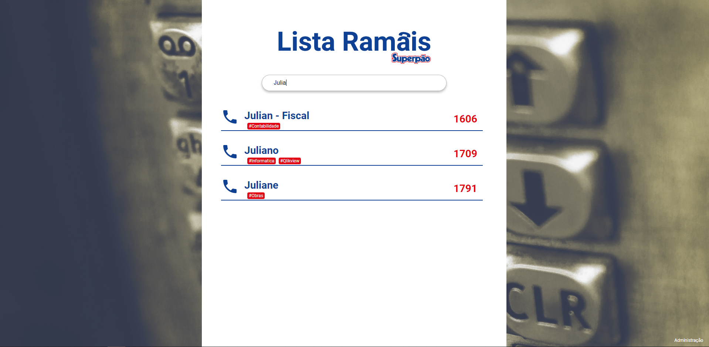
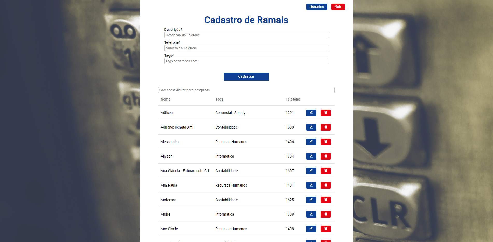

# Digital PhoneBook
Digital PhoneBook is a repository digital the numbers phones

Home Page:


Register Phones:


## Installation and Development setup

```sh
git clone git@github.com:julianosirtori/DigitalPhoneBook.git
cd DigitalPhoneBook
```

FrontEnd:
```sh
cd frontend
yarn install
yarn start
```
Folder up:
```sh
cd ..
```
BackEnd

You need to copy <b>.env.example</b> and rename to <b>.env</b> for work database

```sh
cd backend
yarn install
yarn sequelize db:migrate
yarn sequelize db:seed:all
yarn dev
```
